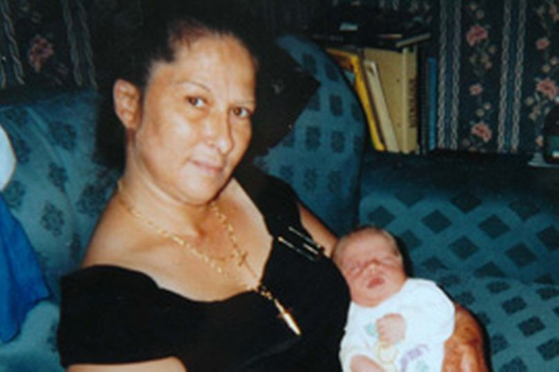

<FIGURE>

<FIGCAPTION>Anne Marie Foy (source: <a href="https://www.liverpoolecho.co.uk/news/liverpool-news/david-butler-found-not-guilty-3352469">Liverpool Echo</a>).</FIGCAPTION>

</FIGURE>

In a 2005 killing  of Anne Marie Foy, David Butler, a former taxi driver from Wavertree, Liverpool, was accused of murdering a local sex worker. An important role in the initial conviction and final acquittal was played by DNA evidence. The prosecution's case was based on DNA trace evidence matching Mr Butler's found on the victim's nail.

Now, you might think, DNA match, case closed! Well, in this case the circumstances were crucial. The victim, as it turns out, was wearing a glitter nail polish which attracted dirt and other extraneous material, and, moreover, Mr Butler suffered from a severe skin condition which made him shed flakes of skin very easily. Finally, the victim - the defense explanation goes - paid in cash, so there was contact between the victim and the suspect's hands. For these reasons, despite a DNA match, Mr Butler [has been acquitted](https://www.liverpoolecho.co.uk/news/liverpool-news/david-butler-found-not-guilty-3352469). Sadly, the case remains open.

The story illustrates two points:

-  In DNA evidence evaluation it is important to distiguish [levels of the hypotheses being discussed](https://plato.stanford.edu/entries/legal-probabilism/#SourActiOffeLeveHypo) (yes, there is a match, but whether a specific action took place is another matter).

-   You might think that it is best that the forensic scientists is blind to all circumstances when processing the samples. However, if the evidence is to be assessed in proper light when it comes to hypotheses other than source level hypotheses, relevant contextual information is crucial! Now, the challenge is to organize the procedure so that the expert receives contextual information, but not anything more, to avoid bias.

Check out Chapter 2 of [Forensic DNA Evidence Interpretation](https://www.routledge.com/Forensic-DNA-Evidence-Interpretation/Buckleton-Bright-Taylor/p/book/9780367778101) edited by John S. Buckleton, Jo-Anne Bright, and Duncan Taylor for more intricacies related to DNA evidence evaluation!
