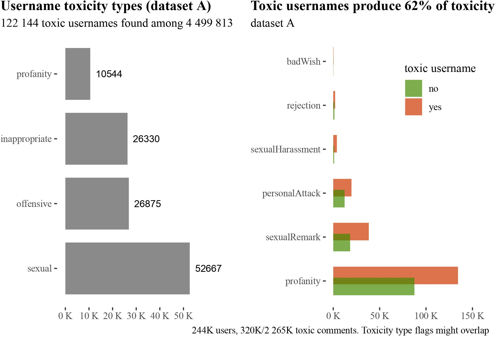
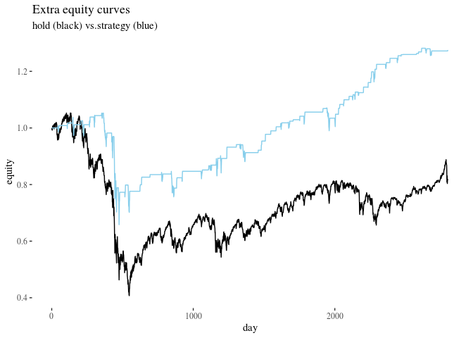
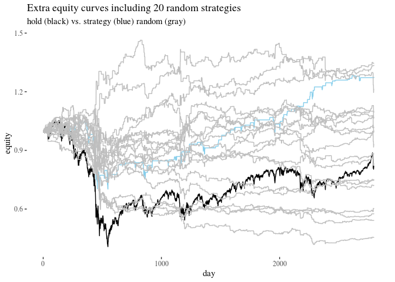
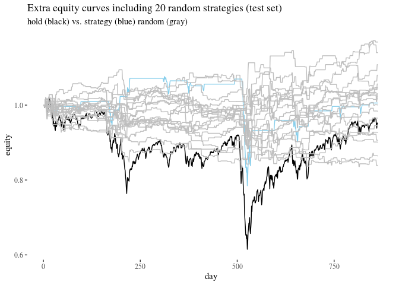

* TOC
{:toc}

## Namespotting: username toxicity and actual toxic behavior on Reddit ([github](https://rfl-urbaniak.github.io/namespotting/))

The data analysis underlying our paper published in Computers and Human Behavior.

Without relying on any user reports, we use algorithmic detection and Bayesian statistical methods to analyse two large data streams (329k users) of Reddit content to study the correlations between username toxicity (of various types, such as offensive or sexually explicit) and their online toxic behavior (personal attacks, sexual harassment among others).  As it turns out, username toxicity (type) is a useful predictor in online profiling. Users with toxic usernames produce more toxic content than their neutral counterparts, with the difference in predicted mean increasing with activity (predicted 1.9 vs. 1.4 toxic comments a week for users with regular activity, and 5.6 vs. 4 for top 5\% active users). More users with toxic usernames engage in toxic behavior than among neutral usernames (around 40\% vs. 30\%). They are also around 2.2 times more likely to have their account suspended by moderators (3.2\% vs. 1.5\% probability of suspension for regular and 4.5\% vs. 2\% for top 5\% users)---detailed results vary depending on the username toxicity type and toxic behavior type. Thus, username toxicity can be used in the efforts of online communities to predict toxic behavior and to provide more safety to their users.

  

## Probabilistic coherence in Bayesian networks ([github](https://rfl-urbaniak.github.io/coherence/))

`R` implemetantion of the main existing probabilistic coherence measures applied to Bayesian networks, together with one we developed with Alicja Kowalewska in "Measuring coherence in Bayesian networks" published in *AI & Law*.

Coherence measures deployed:
- Fitelson's
- Douven-Meijs'
- Olsson's
- Shogenji's
- Roche's
- Kowalewska and Urbaniak's
  

##  Legal Probabilism BNs with R ([github](https://rfl-urbaniak.github.io/LegalProbabilismBNs/))

`R` implementation (with `bnlearn`) of bayesian network methods for criminal evidence evaluation, using the examples  [Marcello Di Bello](https://www.marcellodibello.com/) and I used in our **Legal Probabilism** entry in the *Stanford Encyclopedia of Philosophy*.

- Directed Acyclic Graphs construction for various evidence idioms (hypothesis-evidence, multiple pieces of evidence, measurement error, synthesis nodes, evidence accuracy, opportunity, alibi, dependency between items of evidence, mixed DNA evidence evaluation).
- Integration of DAGs with conditional probability tables.
- Conversion to junction trees, calculation of priors.
- Updating a BN with new evidence, calculation of posterios.
- Propagating new information and converting a junction tree back to BN.
- A case study with a BN for the [Sally Clark case](https://en.wikipedia.org/wiki/Sally_Clark).
- Visualisation of marginal probabilities.
- Some mathematical background explained.

  
  

## Short-term impact of personal attacks on Reddit user activity ([github](https://rfl-urbaniak.github.io/redditAttacks/))

In cooperation with [Samurai Labs](https://www.samurailabs.ai/), we tracked 148,317 users and identified personal attacks among 182,528 posts and comments using their high precision software. I analyzed the data from three perspectives: (i) classical statistical methods, (ii) Bayesian estimation, and (iii) model-theoretic analysis with hurdle and zero-inflated models. They agree: personal attacks decrease the victims' activity.

  
  
  

## Monte carlo backtesting in R ([github](https://rfl-urbaniak.github.io/backtesting/))

Implementation in R of Monte Carlo methods for gauging uncertainty in algorithmic trading strategy evaluation. Illustrates how Monte Carlo Methods and correcting for multiple testing in optimization can undermine claims to significance.

  
  
  
  

##  Bayesian estimation of multi-class bias in word2vec embeddings

We propose Markov chain Monte Carlo methods to supersede cosine-distance-based bias measures such as WEAT and argue that the resulting
picture is not as clear as it initially might have seemed.

DOCUMENTATION UNDER CONSTRUCTION

## Probabilistic coherence measures over bayesian networks

Algorithms for calculating main existing coherence measures over bayesian networks, with a new method essentially relying on the causal structure, implemented in R, building on bnlearn, with application to multiple counterexamples to earlier proposals.

DOCUMENTATION UNDER CONSTRUCTION

## Long-term impact of personal attacks on Reddit user activity

Another cooperation with [Samurai Labs](https://www.samurailabs.ai/). Methods for multiple time series with covariates deployed to study the impact of personal attacks on
25k users of Reddit over 10 weeks.

DOCUMENTATION UNDER CONSTRUCTION
